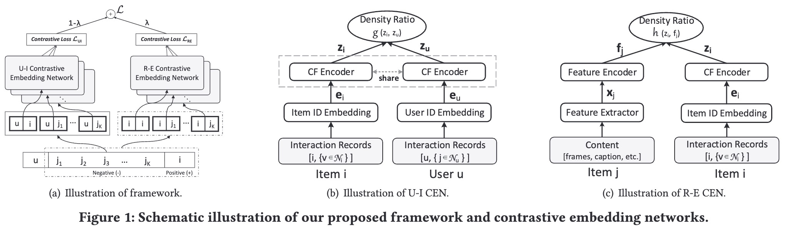

# Contrastive Learning for Cold-Start Recommendation

> A new framework that reformulates cold-start item representation learning from an information-theoretic standpoint, maximizing mutual dependencies between item content and collaborative signals via contrastive learning.

---
## Authors

**Yinwei Wei**<sup>1</sup>, **Xiang Wang**<sup>2</sup>, **Qi Li**<sup>1</sup>, **Liqiang Nie**<sup>1</sup>\*, **Yan Li**<sup>3</sup>, **Xuanping Li**<sup>3</sup>, **Tat-Seng Chua**<sup>2</sup>

<sup>1</sup> Shandong University, China  
<sup>2</sup> National University of Singapore, Singapore  
<sup>3</sup> Lenovo, China  
\* Corresponding author

---

## Links

- **Paper**: [`ACM MM'21`](https://dl.acm.org/doi/epdf/10.1145/3474085.3475665)
- **Code Repository**: [`GitHub`](https://github.com/weiyinwei/CLCRec)

---

## Table of Contents

- [Updates](#updates)
- [Introduction](#introduction)
- [Highlights](#highlights)
- [Method / Framework](#method--framework)
- [Installation](#installation)
- [Dataset](#dataset)
- [Usage](#usage)
- [Citation](#citation)

---

## Updates

- [10/2021] Paper presented at ACM MM 2021.
- [07/2021] Paper released on arXiv.

---

## Introduction

This is the official PyTorch implementation for the ACM MM 2021 paper **Contrastive Learning for Cold-Start Recommendation**.

Recommending cold-start items is a long-standing and fundamental challenge in recommender systems. In this work, we reformulate the cold-start item representation learning from an information-theoretic standpoint. It aims to maximize the mutual dependencies between item content and collaborative signals. Specifically, the representation learning is theoretically lower-bounded by the integration of two terms: mutual information between collaborative embeddings of users and items, and mutual information between collaborative embeddings and feature representations of items. 

To model such a learning process, we devise a new objective function founded upon contrastive learning and develop a new **Contrastive Learning-based Cold-start Recommendation framework (CLCRec)**.

---

## Highlights

- **Information-Theoretic Standpoint**: Reformulates cold-start item representation learning by maximizing mutual dependencies between item content and collaborative signals.
- **Contrastive Learning Framework**: Proposes **CLCRec**, which consists of three core components: contrastive pair organization, contrastive embedding, and contrastive optimization modules.
- **Robust Representation**: Effectively preserves collaborative signals in the content representations for both warm and cold-start items.
- **Superior Performance**: Achieves significant improvements over state-of-the-art approaches in both warm- and cold-start scenarios.

---

## Method / Framework



**Figure 1.** Overall framework of the proposed CLCRec model.

---

## Installation

The code has been tested running under **Python 3.5.2**. The required packages are as follows:

- Pytorch == 1.1.0
- torch-cluster == 1.4.2
- torch-geometric == 1.2.1
- torch-scatter == 1.2.0
- torch-sparse == 0.4.0
- numpy == 1.16.0

You can install the dependencies via pip:

```
pip install torch==1.1.0
pip install torch-scatter==1.2.0 torch-sparse==0.4.0 torch-cluster==1.4.2 torch-geometric==1.2.1
pip install numpy==1.16.0
```

## Usage
The instruction of commands has been clearly stated in the codes.

- Movielens dataset  
`python main.py --model_name='CLCRec' --l_r=0.001 --reg_weight=0.1 --num_workers=4 --num_neg=128 --has_a=True --has_t=True --has_v=True --lr_lambda=0.5 --temp_value=2.0 --num_sample=0.5` 

- Amazon dataset  
`python main.py --model_name='CLCRec' --data_path=amazon --l_r=0.001 --reg_weight=0.001 --num_workers=4 --num_neg=512 --has_v=True --lr_lambda=0.9 --num_sample=0.5`  

Some important arguments:  


- `lr_lambda`: 
  It specifics the value of lambda to balance the U-I and R-E mutual information.

- `num_neg` 
  This parameter indicates the number of negative sampling.  
  
- `num_sample`:
  This parameter indicates the probability of hybrid contrastive training.
  
- `temp_value`:
   It specifics the temprature value in density ratio functions.
## Dataset
We provide two processed datasets: Movielens and Amazon. (The details could be found in our article)
For Kwai and Tiktok datasets, due to the copyright, please connect the owners of datasets.


## Citation
If you want to use our codes and datasets in your research, please cite:

``` 
@inproceedings{CLCRec,
  title     = {Contrastive Learning for Cold-start Recommendation},
  author    = {Wei, Yinwei and 
               Wang, Xiang and 
               Qi, Li and
               Nie, Liqiang and 
               Li, Yan and 
               Li, Xuanqing and 
               Chua, Tat-Seng},
  booktitle = {Proceedings of the 29th ACM International Conference on Multimedia},
  pages     = {--},
  year      = {2021}
}
``` 
